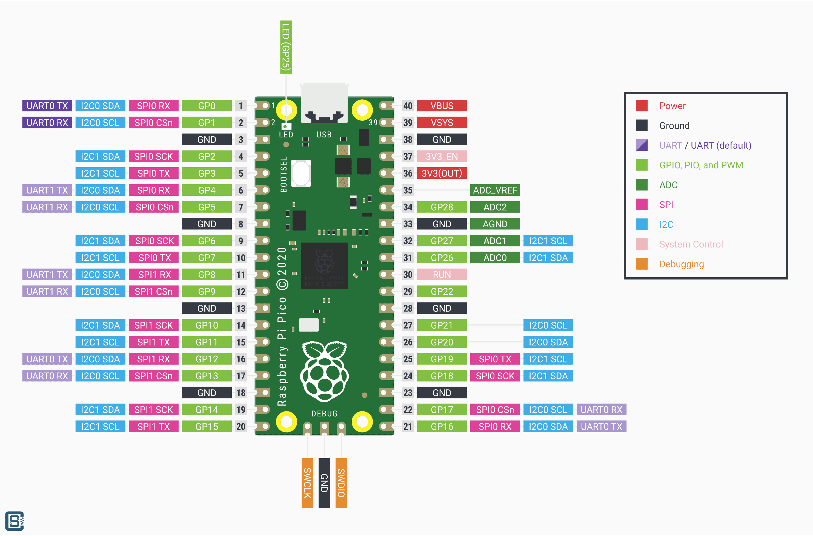

# README
A basic template for Rust projects based on the RP2040

**MAKE SURE TO UPDATE**

Make sure to update `.cargo/config.toml` to match how you are connecting to the RP2040 (probe or direct over USB)

## Getting started

Follow guide here: https://embassy.dev/book/dev/getting_started.html

## Running 

plug in the dev board and just run:
```bash
cargo run
```

## Devboard Pinout
